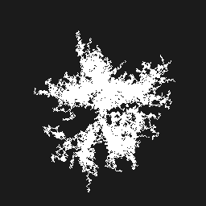

+++
title = "Angled Random Walks for <abbr>DLA</abbr>-like Terrain Generation"
date = 2024-08-03
draft = false

[taxonomies]
category = ["procedural-generation"]

[extra]
image = "thumb.png"
+++

I watched this excellent video, [*Better Mountain Generators That Aren't Perlin Noise or Erosion*](https://www.youtube.com/watch?v=gsJHzBTPG0Y) by [Josh's Channel](https://www.youtube.com/@JoshsHandle). It discusses generating mountain heightmaps
using a technique called [Diffusion-Limited Aggregation](https://en.wikipedia.org/wiki/Diffusion-limited_aggregation). The structures produced by this process are known as Brownian trees.

Growing Brownian tree. Animation by [あるうぃんす](https://commons.wikimedia.org/wiki/File:Brownian_tree.gif).

In <abbr>DLA</abbr>, we start with a seed typically placed at the center. At each step, we randomly place points on the grid and then random-walk them until they hit an existing particle, at which point they are frozen there. This is, of course, very inefficient. The video describes a good technique to get it to be faster, by starting with a small grid and doing a This upscale isn't done directly on the pixels — instead, we keep track of which pixel sticks to which, and use that graph to populate a larger grid. after the grid is filled to a certain degree, and repeating the process until we get to the desired size.

But my immediate thoughts after the video were that surely this would be faster the other way round — by generating outwards from the initial seed. After experimenting with a lot of approaches, I found a way that yields _fairly_ <abbr>DLA</abbr>-like results with much less computational cost.

## Approach

We have a number of *random walkers* on the grid. Each of them has these properties:

  1. *Age*: How many pixels it travelled since it was spawned.
  2. *Generation*: How many parent walkers it has.
  3. *Angle*: What angle the walker aims towards.
  4. *Type*: Is it a _long_ or _short_ walker. _Short_ walkers don't split into more walkers when they end.

The algorithm for generation is:

  1. Start with a grid of zeros.
  2. Place a number of walkers at the centre, all aimed at different angles.
  3. While there are any walkers:
      - If it is a long walker and its age module some frequency parameter is zero, spawn a short walker at that position.
      - If its age is greater than some maximum age, it dies, and…
        - If its generation is less than some maximum generation, and it is a long walker, spawn some number of long walkers where it stopped, each aimed slightly offset from the parent's angle.
      - Else, the walker moves in a random direction, chosen via weighted sampling where the weights are smaller the larger the angular distance between that direction and the target angle, and Otherwise, the walkers wind back on themselves and fail to spread apart sufficiently. An example of what that looks like:  by subtracting its weight from every weight. The point it moves to is filled in on the grid.

## Implementation

I've written a Rust implementation of this algorithm.

  - *Repository*: [bharadwaj-raju / angled-random-walker](https://github.com/bharadwaj-raju/angled-random-walker)
  - *Crates.io*: [angled-random-walker](https://crates.io/crates/angled-random-walker)
  - *Documentation*: [angled_random_walker on docs.rs](https://docs.rs/angled-random-walker/latest/angled_random_walker/)

## Heightmap

By filling each walked pixel with the cumulative age of its walker, and blurring the result, we get a simple heightmap. But this just gives you mountain-like smooth blobs.

To get more interesting terrain, we superimpose a clamped and lightly-blurred version. This preserves the smaller and sharper details generated in the process. The effect is — in my estimation — close to the sought-after erosion look.

## Demonstration

This is a _live_ demonstration. Play around with the sliders to immediately see your changes. To make it easier to isolate the effects of varying parameters, the seed is held constant — click "Randomize Seed" to generate from a new seed.

    
    This demonstration uses the same implementation linked above, through a <abbr>WASM</abbr> layer. The source code of the <abbr>WASM</abbr> module can be found [here](https://github.com/bharadwaj-raju/angled-random-walker-demo-wasm).
    Eight initial walkers are used here, aimed at each of the cardinal and ordinal directions. The library lets you customize the number and angles of the walkers, if you wish.
    

        

            <canvas x-init="canvas2dContext = $el.getContext('2d')" id="demo-canvas" width="512" height="512"></canvas>
            <button @click="seed = generateSeed()" id="gen-btn">Randomize Seed</button>
        

        

            

                <label for="max-long-age">Max long walker age: </label>
                <input type="range" id="max-long-age" x-model="longAge" min="1" max="100" step="1">
            

            

                <label for="max-short-age">Max short walker age: </label>
                <input type="range" id="max-short-age" x-model="shortAge" min="1" max="100" step="1">
            

            

                <label for="max-gen">Max generations: </label>
                <input type="range" id="max-gen" x-model="generations" min="1" max="10"  step="1">
            

            

                <label for="max-children">Children spawned: </label>
                <input type="range" id="max-children" x-model="maxChildren" min="1" max="5"  step="1">
            

            

                <label for="short-branch-freq">Short branch every:  steps</label>
                <input type="range" id="short-branch-freq" x-model="shortBranchFreq" min="1" max="70"  step="1">
            

            

                <label for="long-angle-divergence">Max long child divergence: &nbsp;π</label>
                <input type="range" id="long-angle-divergence" x-model="longDivergence" min="0.1" max="1.0"
                    step="0.05">
            

            

                <label for="short-angle-divergence">Max short child divergence: &nbsp;π</label>
                <input type="range" id="short-angle-divergence" x-model="shortDivergence" min="0.1" max="1.0"
                    step="0.05">
            

        

    

    
And in <abbr>3D</abbr>:

    Please excuse the plainness. I don't yet know enough <abbr>3D</abbr> graphics to make it nicely Earth-colored _and_ give it lighting and shading such that you can actually see the details.
    

        

        

            

                <label for="blur-radius">Blur radius: </label>
                <input type="range" id="blur-radius" x-model="blurRadius" min="1" max="32" value="20" step="1">
            

            

                <label for="details-max">Details layer max: </label>
                <input type="range" id="details-max" x-model="detailsMax" min="1" max="20" value="15" step="1">
            

        

    

## Similar Stuff

[Planet Eleven Games](https://planet11games.com/) posted about [*Using drunken walk for height maps*](https://old.reddit.com/r/proceduralgeneration/comments/1bup6wm/using_drunken_walk_for_height_maps/). They were inspired by the exact same video, but the approach they use is different, involving an unbiased random expansion with each new pixel having a chance of dropping in height. Check out their [demo](https://planet11games.com/drunkwalk/).
