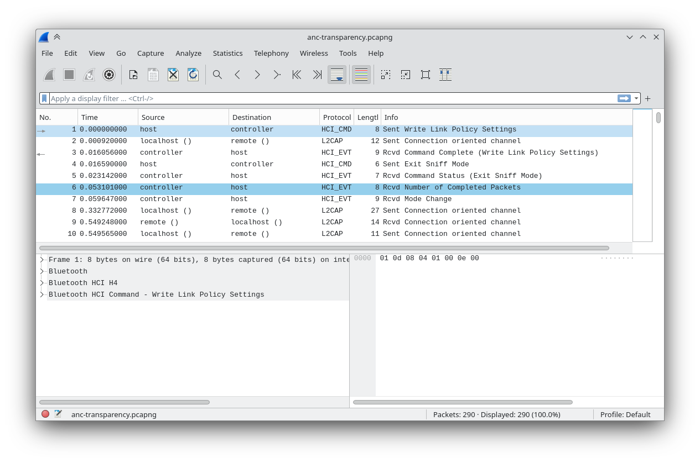
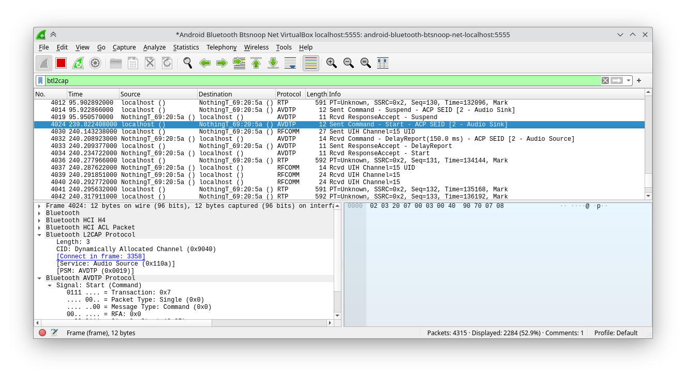

+++
title = "Creating a Linux controller for the Nothing Ear (2)"
date = 2024-01-06
draft = false
+++

I bought a [Nothing Ear (2)](https://nothing.tech/products/ear-2), and I’m mostly happy with it. It comes 
with a neat-looking Android app to let you set the noise cancellation level and equalization and such.

That’s fine, but it would be cool to be able to control it from my Linux computer as well. So here we are. 
We’re going to reverse-engineer the Bluetooth protocol that it speaks, and from there 
develop a Linux controller. In the spirit of [Nothing Chats](https://www.youtube.com/watch?v=A9PP8AeSbbo), I’m sure Carl Pei would be appreciative.

If you don’t want to read the technical details of how this was achieved, skip to the [*Finished Product*](#the-finished-product).


There exists a reverse-engineered controller for the Ear (2) already! It’s called [Ear (PC)](https://github.com/radiance-project/ear-pc). It’s great and looks sleek, but unfortunately it’s Windows-only, and the actual Bluetooth communication code is not released and kept private for &ldquo;the security of the users&rdquo;. That’s no good for us.


## All the things that didn’t work

This was the first time I had reverse engineered anything. I ran down a lot of dead ends:

  - ***Decompiling the actual Android app.***
      
      The generated assembly (Smali) and decompiled Java code are just unreadable.

  - ***Monitoring Bluetooth traffic from my Android.***

      Doing this live would need root, or specialized hardware like the [Ubertooth One](https://greatscottgadgets.com/ubertoothone/).

  - ***Monitoring Bluetooth traffic from [Waydroid](https://waydro.id/).***

      Waydroid [does not support Bluetooth passthrough](https://github.com/waydroid/waydroid/issues/155).

Finally I thought of running Android-x86 in a VM, giving it Bluetooth, and analyzing traffic from there.

At this point I should thank [Michal Jirků](https://wejn.org/about/). While searching about snooping on 
Android-x86 traffic from the host, I found their series of posts on doing a very similar thing for their Yamaha 
YAS-207. That confirmed that I had indeed stumbled on a productive approach.

## Snooping on Bluetooth from Android-x86

So I set up an Android-x86 VM on VirtualBox and passed through Bluetooth.


Bluetooth didn’t work on the Android-x86 guest at first. I had to run these commands as root on the Android (from user Jikodis on [this issue](https://github.com/android-x86/android-x86.github.io/issues/91#issuecomment-987475588")):

```shell
# hciconfig hci0 down
# pm disable com.android.bluetooth
# pm enable com.android.bluetooth
# service call bluetooth_manager 6
# hciconfig hci0 up</code></pre>
```

Try that if Bluetooth doesn’t work despite you enabling passthrough of the Bluetooth USB device.

One more thing: if you pass through Bluetooth to one VM session, you *might* have to reboot your host to get it back. There’s probably some command that does that without rebooting, but this is just so you keep the possibility in mind.


After a lot of fiddling with the Android Bluetooth settings, restarting, and so on, finally:

Look at the pixelation on those images. This app wasn’t built with this DPI in mind.

After setting up developer options to enable Bluetooth HCI sniffing and USB debugging, we can See the &ldquo;using adb with a NAT’ed VM&rdquo; section in [the Android-x86 docs](https://www.android-x86.org/documentation/debug.html). Change the `adb localhost:5555` command to `adb connect localhost:555`..

Once we’ve connected ADB, we can simply select the Android device in Wireshark running on the host, and get our first look at the Bluetooth traffic.



The whole thing appears to be very chatty; there are nearly 300 events when I do something as simple as changing the ANC mode. Presumably only some of them are actually relevant, but that is a lot to sift through.

## Protocol Analysis

One neat trick: if you disconnect and reconnect the earphones while a Wireshark capture is running, the capture logs get a lot more detailed! Compare this to the previous screenshot:



All the &ldquo;Connection oriented channel&rdquo; packets get turned into actual commands and responses with the correct protocol! Great.

From this we can sift through the packets better. The first thing I tested was switching between having the ANC off and on transparency mode. If we leave the huge `PT=Unknown` packets of ~592 bytes alone for a minute, we’ll observe This observation didn’t come directly. I wasted a lot of time chasing even more dead ends like trying to connect to the Audio Sink service. that every time the ANC is set to transparency, a lot of commands are sent over RFCOMM to channel 15:


Let’s try manually constructing and sending these packets to the device, back on desktop Linux. I used Wireshark to filter all packets of channel 15 and saved it as JSON,
then wrote a [quick Python script](https://gitlab.com/-/snippets/3636681) to read all the packets and send them out, with a 1 second gap to let me observe the effects. When I ran it, I finally heard that sigh in my ear that signalled transparency mode. This is the packet that does it:

```text
55:60:01:0f:f0:03:00:cb:01:07:00:c5:af
```

This is clearly the right track. After trying more captured packets, here is the table of commands to do various operations:

|  Command  |  Packet  |
|-----------|----------|
| ANC Transparency | `55:60:01:0f:f0:03:00:cb:01:07:00:c5:af` |
| ANC Off | `55:60:01:0f:f0:03:00:cd:01:05:00:c4:47` |
| ANC High | `55:60:01:0f:f0:03:00:cf:01:01:00:e6:6f` |
| ANC Mid | `55:60:01:0f:f0:03:00:d5:01:02:00:e6:9f` |
| ANC Low | `55:60:01:0f:f0:03:00:d7:01:03:00:e7:0f` |
| ANC Adaptive | `55:60:01:0f:f0:03:00:dd:01:04:00:e5:3f` |
| In-ear detection Off | `55:60:01:04:f0:03:00:25:01:01:00:b2:94` |
| In-ear detection On | `55:60:01:04:f0:03:00:26:01:01:01:73:10` |
| Low-latency mode Off | `55:60:01:40:f0:02:00:28:02:00:a7:04` |
| Low-latency mode On | `55:60:01:40:f0:02:00:27:01:00:97:f7` |

### Ear Tip Fit Test

The packet to start an ear tip fit test is `55:60:01:14:f0:01:00:2a:01:43:16`. We get back some results indicating if the left and right earbuds fit well.

If the left earbud doesn’t fit, but the right does, we get this packet:

```text
0000   55 00 01 0d e0 02 00 00 01 00
```

If both earbuds fit:

```text
0000   55 00 01 0d e0 02 00 00 00 00
```

We can make a good guess that the last two bytes represent 0 = good fit, 1 = bad fit, for L/R respectively (further testing confirms this).

### Device Info

If we look at the first few packets exchanged when a connection is made on the Android app, and experiment with sending them, we notice that sending `55:60:01:42:c0:00:00:03:e0:d1` gives us this reply, which contains the firmware version (1.0.1.101):

```text
0000   55 60 01 42 40 09 00 03 31 2e 30 2e 31 2e 31 30   U`.B@...1.0.1.10
0010   31 fa 36                                          1.6
```

The version number is 9 characters, so it’s possible the 6th byte `09` encodes this length information. I guess we’ll test this theory if we ever get a firmware update that changes the number of digits.

And if we send `55:60:01:06:c0:00:00:05:90:dc`, we get this:

```text
0000   55 60 01 06 40 88 00 05 09 32 2c 31 2c 31 2e 30   U`..@....2,1,1.0
0010   2e 31 0a 32 2c 32 2c 31 2e 30 2e 31 2e 31 30 31   .1.2,2,1.0.1.101
0020   0a 32 2c 34 2c 53 48 31 30 31 38 32 33 30 37 30   .2,4,SH101823070
0030   30 32 38 30 37 0a 33 2c 31 2c 31 2e 30 2e 31 0a   02807.3,1,1.0.1.
0040   33 2c 32 2c 31 2e 30 2e 31 2e 31 30 31 0a 33 2c   3,2,1.0.1.101.3,
0050   34 2c 53 48 31 30 31 38 32 33 30 37 30 30 32 38   4,SH101823070028
0060   30 37 0a 34 2c 31 2c 31 2e 30 2e 31 0a 34 2c 32   07.4,1,1.0.1.4,2
0070   2c 31 2e 30 2e 31 2e 31 30 31 0a 34 2c 34 2c 53   ,1.0.1.101.4,4,S
0080   48 31 30 31 38 32 33 30 37 30 30 32 38 30 37 0a   H10182307002807.
0090   91 d1                                             ..
```

That string starting with `SH101` is the serial number.

If you open an RFCOMM channel 15 and listen for every incoming packet, you’ll notice that a packet is sent for every &ldquo;change&rdquo; to the device. For example, if I change the ANC, I get a packet starting with `55:00:01:03:e0`. Now, can I get the ANC status on demand, without there being a change? For this I looked at more packets sent during early communication, to see which got different responses when I changed the ANC. I found that when I sent `55:60:01:1e:c0:01:00:0c:03:98:19`, I get:

```text
0000   55 60 01 1e 40 06 00 0c 01 07 00 02 04 00 10 7a
```

The 10th byte appears to correspond to the ANC.
Which, we can notice, is the same as the 10th byte in the command to *set* ANC. Turns out we can simplify those seemingly-different ANC commands to just one with the 10th byte alone differing.

| Byte | ANC Mode |
| ---- | -------- |
| 7    | Transparency |
| 5    | Off |
| 4    | Adaptive |
| 3    | Low |
| 2    | Mid |
| 1    | High|


### Shortcuts

The Ear (2) has a number of different pinch/hold controls.

Whenever we click on the controls for the left earbud, the app sends out `55:60:01:18:c0:00:00:51:39:21` and receives, for example, this in response:

```text
0000   55 60 01 18 40 21 00 51 08 02 01 02 08 03 01 02
0010   09 02 01 03 08 03 01 03 08 02 01 07 16 03 01 07
0020   16 02 01 09 01 03 01 09 01 e0 30
```

If we change one shortcut (set left double-pinch to skip forward), we get:

```text
0000   55 60 01 18 40 21 00 1d 08 02 01 02 09 03 01 02
0010   09 02 01 03 08 03 01 03 08 02 01 07 16 03 01 07
0020   16 02 01 09 01 03 01 09 01 39 6d
```

We see changes on bytes 8 and 13 (`08` → `09`), and in the last two bytes. If we change left double-pinch to voice assistant, we get:

```text
0000   55 60 01 18 40 21 00 1d 08 02 01 02 0b 03 01 02
0010   09 02 01 03 08 03 01 03 08 02 01 07 16 03 01 07
0020   16 02 01 09 01 03 01 09 01 b9 6e
```

Compared to last time, only byte 13 is changed (to `0b`). I guess byte 13 represents the actual action.

Let’s try setting triple pinch to skip forward:

```text
0000   55 60 01 18 40 21 00 1d 08 02 01 02 09 03 01 02
0010   09 02 01 03 09 03 01 03 08 02 01 07 16 03 01 07
0020   16 02 01 09 01 03 01 09 01 29 bc
```

This time the 21st byte is changed. If I set triple pinch to voice assistant, that 21st byte changes to `0b`.

This is the table of shortcuts and byte positions:

| Shortcut | Byte index (from 0) |
| -------- | ------------------- |
| Left double-pinch | 12 |
| Left triple-pinch | 20 |
| Left pinch-hold | 28 |
| Left double-pinch-hold | 36 |
| Right double-pinch | 16 |
| Right triple-pinch | 24 |
| Right pinch-hold | 32 |
| Right double-pinch-hold | 40 |

And of shortcut actions and their encodings:

| Action | Encoding |
| ------ | -------- |
| Skip Back | `0x08` |
| Skip Forward | `0x09` |
| Voice Assistant | `0x0b` |
| Volume Up | `0x12` |
| Volume Down | `0x13` |
| Noise Control (Active/Off) | `0x14` |
| Noise Control (Transparency/Active) | `0x16` |
| Noise Control (Transparency/Active/Off) | `0xa` |
| Noise Control (Transparency/Off) | `0x15` |
| No Action | `0x01` |

Looking at the commands to change shortcuts now (this is to set left triple-pinch to skip forward):

```text
0000   55 60 01 03 f0 05 00 59 01 02 01 03 09 de 71
```

I noticed that the 13th byte encodes the shortcut action, and the previous two bytes match the previous two bytes before the index of that shortcut in the shortcut-info response as we figured out earlier. Now we can set the shortcut for any action.

And what’s really cool is that like this we can use configurations that the official Nothing X app doesn’t allow, yet are possible on the device. For example, the app restricts double-pinch to skip forward/back and voice assistant. But now I can make double-pinch do noise control or volume up/down as well.


## The Finished Product

You can get the CLI tool here: [bharadwaj-raju / ear2ctl](https://gitlab.com/bharadwaj-raju/ear2ctl).

```console
$ ear2ctl info
Address: 2C:BE:EB:69:20:5A
Firmware version: 1.0.1.101
Serial number: SH10182307002807

$ ear2ctl anc
ANC: off

$ ear2ctl anc transparency

$ ear2ctl anc
ANC: transparency

$ ear2ctl shortcuts
left:
        double-pinch: skip-forward
        triple-pinch: skip-back
        pinch-hold: noise-control-transparency-active-off
        double-pinch-hold: voice-assistant
right:
        double-pinch: skip-forward
        triple-pinch: skip-back
        pinch-hold: voice-assistant
        double-pinch-hold: noise-control-transparency-off

$ ear2ctl shortcuts right double-pinch-hold no-action

$ ear2ctl --help
Controls for the Nothing Ear (2)

Usage: ear2ctl <COMMAND>

Commands:
  info              Device information
  shortcuts         View and set pinch gestures
  anc               Control active noise cancellation
  ear-tip-fit-test  Start or stop the ear tip fit test
  in-ear-detection  Turn in-ear detection on or off
  low-latency-mode  Turn low latency mode on or off
  help              Print this message or the help of the given subcommand(s)

Options:
  -h, --help     Print help
  -V, --version  Print version

```
