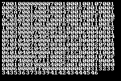

+++
title = "Writing an Emulator and Assembler for a Fictional Console"
date = 2023-04-25
draft = false
+++
I was bored of emulating existing systems.

I had written a CHIP-8 emulator and was halfway through writing a GameBoy emulator, and it was fun enough. But I wanted to see if I could design my own, entirely fictional, "chip" with its own instructions and quirks and stuff. There is of course inspiration drawn from CHIP-8, both in terms of what I took and what I avoided.


Here is the code: It's named "March" as in "my architecture", and also after the GCC flag..

## Design

This thing has:

- 32 2-byte registers
- 32 level stack (only used to nest function calls)
- 240x160 pixels full 24-bit RGB display, but with a palette of only 16 colors
- 32 sprites
- a timer
- A, B, X, Y and directional key input
- 64 whole KiB of memory (addressable 2 bytes at a time)
- a built-in 8x8 bitmap font for ASCII characters, public domain courtesy of Daniel Hepper

You can see that this was built to have more room than the CHIP-8, but not too much so.

There is only one single immediate mode instruction in this thing, and that is to set the value of a register. Everything else operates on registers. Nothing just takes a straightforward value. This makes you use and reuse a ton of registers for every little thing, but that's the price we pay for flexibility. And this thing sure has flexibility; you can basically rewrite your own ROM on the fly.

Each instruction is 3 words, or 6 bytes. The first word is the opcode, and the others are arguments. For example, the 
instruction to draw a sprite looks like this:

```plaintext
0x1007 0xXXYY 0x00NN  # draw sprite number stored in register N at the coordinates (registerX, registerY)
```

## The Emulator Itself

The CPU, interpreter of instructions, sits in `march.h`. The `march_cpu` struct holds all the memory, stack, and 
program counter stuff. The function `march_step` executes the next instruction (by means of a massive switch-case) and 
moves the program counter forward appropriately. Arguments are extracted by usual bit manipulation. For example, the 
"draw sprite" instruction I mentioned earlier is decoded like this:

```c
// reg is the register array
uint8_t x = march->reg[arg1 >> 8];
uint8_t y = march->reg[arg1 & 0x00ff];
uint8_t n = march->reg[arg2 & 0x00ff];
```

By itself the `march.h` doesn't do much; you have to write a frontend for it. There's a no-graphics frontend in `marchemu.c`, mostly just useful for testing, and a graphical frontend using SFML in `marchemu-gui.cpp`.

## Assembler

Honestly my favorite part of making this.

This is a sample for how code in this assembly looked:

```less
setreg(R0, 0)
setreg(R1, 1)
setreg(R2, 10)
setreg(R3, 4*6)
skipifeq(R0, R2, 3)
add(R0, R1, R0)
printreg(R0)
jump(R3)
stopexec()
```

This prints numbers 1 to 10. Note the `4*6` there: it means the fourth instruction, because each instruction is 6 bytes long. You can see how that would get cumbersome — we'll address it.

Originally my assembler worked in a bit too straightforward manner.
The "assembly" source files were just Python scripts, the "instructions" were function calls defined in `asm.py`, 
and `asm.py` would define those functions then read your "assembly" and just `exec()` it.

This was fun and made some cool things possible, like having your assembly generate random sprites at compile-time, or do math expressions and whatnot. That is how the project sat for some years. When I picked it back up recently, I had learned some basic parsing, and so I wanted to make a more proper assembler, with better features this time.

### Assembler v2: Labels

Code written in the first generation of this assembler was difficult to follow, and you might as well forget about modifying it. That's because there were no labels to jump to, you had to give it the exact instruction number. So if you added or removed any instructions, be sure to remember to alter *all* the jump positions!

So version 2 of my assembler added named labels. Now you could put labels anywhere, and the assembler would automatically replace them with the actual calculated instruction position.

Let's see how that same sample code looks now:

```less
setreg(R0, 0)
setreg(R1, 1)
setreg(R2, 10)
setreg(R3, %loop)

%loop:
skipifeq(R0, R2, 3)
add(R0, R1, R0)
printreg(R0)
jump(R3)
stopexec()
```

Much better.

### Assembler v2: Data-driven assembly

I also didn't like how my instructions and their arguments were specified in my spec.txt and my asm.py and my march.h. I could reduce at least two of those. So I made an [instructions.json](https://gitlab.com/0xcd7c14/march/-/blob/master/instructions.json), which asm.py reads from to know what instructions there are and what arguments they take and how to pack them.

Here is the entry in instructions.json for the sprite drawing one:

```json
"0x1007": {
    "arg-format": [
        "0xXXYY",
        "0x00NN"
    ],
    "description": "draw sprite regN at (regX, regY)",
    "asm": "drawsprite"
}
```

The assembler has a `pack_arguments` function which uses the entries in `arg-format` to get the width and position of each argument. Then it just assembles the correct hex string based on this, and done.

And this also now serves as the new "documentation" for the human programmer. Sure, it's a bit more verbose than the txt, but with Ctrl+F one can manage.

Version 2 also actually parses the assembly, and doesn't just straight-up exec() it. It's not perfect still: you can't split instructions over multiple lines, for instance.
Someday I might make this a better parser, but that's fairly low priority for now.

### Assembler v2: Error reporting

Having the assembler fail with an `IndexError` because you didn't provide enough arguments with no indication of what part of your code is causing it is less than ideal. Even worse is having the assembler silently generate wrong code because you passed in an argument which wouldn't fit in the field, and it tried to pack it in there anyway.

So with some more effort, we can add some nice error reporting to our assembler. Now it tells you what went wrong and where, and uses the power of JSON-as-docs to even pull out the documentation for you:

```plaintext
Line 55: Not enough arguments for setreg.
Arguments for setreg:
    X, N (0x00XX 0xNNNN)
    set register X to 0xNNNN
```

and

```plaintext
Line 50: Argument 32 cannot be packed into field of width 1.
Arguments for drawchar:
    X, Y, F, B, C (0xXYFB 0x00CC)
    draw ASCII character code regC at (regX, regY), fg palette = regF, bg palette = regB
Consider using a register <= 15.
```

Now our assembler is a lot more usable.

## Programs

### Invaders

The longest program I've written in this thing is a very basic Invaders clone.

<video controls src="https://gitlab.com/0xcd7c14/march/-/raw/master/img/invaders.webm" alt="Gameplay video"></video>

Here's the source code: [`invaders`](https://gitlab.com/0xcd7c14/march/-/blob/master/programs/invaders).

### Quine

Here's a more interesting program: it displays its own ROM on the screen.



Here's the source code: [`guiquine`](https://gitlab.com/0xcd7c14/march/-/blob/master/programs/guiquine) and also below.

```less
setreg(R_MEM_PTR, 0)
setreg(R_SHIFT_FOUR, 16)  # (x >> 4) == (x / 2^4)
setreg(R_INC, 1)
setreg(R_CHARMAP_ADDR, %charmap)
setreg(R_LOOP_ADDR, %loop)
setreg(R_X_POS, 4)
setreg(R_ONE, 1)
setreg(R_ZERO, 0)
setreg(R_255, 255)
setpalette(R_ONE, R_255, R_255, R_255)
setreg(R_Y_POS, 4)
setreg(R_PIXEL_SHIFT, 8)
setreg(R_MAX, 250)  # number of bytes in the ROM
setreg(R_X_MAX, 225)

clearscreen(R_ZERO)

%loop:
readmem(R_MEM, R_MEM_PTR)
setregXtoregY(R_UPPER, R_MEM)
setregXtoregY(R_LOWER, R_MEM)
div(R_UPPER, R_SHIFT_FOUR, R_UPPER)
setregXtoregY(R_CHAR, R_CHARMAP_ADDR)
add(R_CHAR, R_UPPER, R_CHAR)
readmem(R_CHAR, R_CHAR)
drawchar(R_X_POS, R_Y_POS, R_ONE, R_ZERO, R_CHAR)
add(R_X_POS, R_PIXEL_SHIFT, R_X_POS)
mul(R_UPPER, R_SHIFT_FOUR, R_UPPER)
subtract(R_LOWER, R_UPPER, R_LOWER)
setregXtoregY(R_CHAR, R_CHARMAP_ADDR)
add(R_CHAR, R_LOWER, R_CHAR)
readmem(R_CHAR, R_CHAR)
drawchar(R_X_POS, R_Y_POS, R_ONE, R_ZERO, R_CHAR)
setdrawflag()
add(R_MEM_PTR, R_INC, R_MEM_PTR)
add(R_X_POS, R_PIXEL_SHIFT, R_X_POS)
skipifleq(R_X_POS, R_X_MAX, 2)
setreg(R_X_POS, 4)
add(R_Y_POS, R_PIXEL_SHIFT, R_Y_POS)
skipifgeq(R_MEM_PTR, R_MAX, 1)
jump(R_LOOP_ADDR)

pauseexec()

%charmap:
literalstr("0123456789ABCDEF")
```

## Thoughts

One of my favorite projects. It taught me parsing, bit manipulation, some idea of a low-level instruction set, and gave me a taste of programming in an assembly-level language.

If you're bored or finished with the standard recommendation of CHIP-8, you might enjoy doing something like this. Make up your own chip.